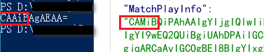
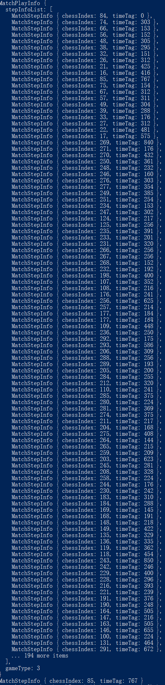

<div align="center"></div>

🐍 **[查看v1版本](./v1/README.md)** 🐍


# 🐏了个🐏 - v2

## 一、刷日常挑战 (首发)

想直接看结果的, 代码位置在 v2/sheep_crack， 下面是关于分析这款程序的路程， 用时约3小时。

### 1. 分析正常业务逻辑

请求挑战:

* GET /sheep/v1/game/map_info_ex?matchType=3

​		拿到 map_md5 和 map_seed

请求游戏地图:

* GET /maps/{map_id}.txt

完成挑战:

* POST /sheep/v1/game/game_over_ex?

​		提交 MatchPlayInfo

查询成绩:

* GET /sheep/v1/game/personal_info?

  通过 daily_count ， today_time 等判断今日挑战完成情况


### 2. 确认目标

跳过正常的游戏过程，直接构造游戏完成的结果反馈给服务器，以此快速并持续的刷日常挑战完成数


### 3. 黑盒分析后端处理逻辑

首先，观察重放已成功完成挑战的请求重放是否有效:

1. 完成挑战，抓包，重放，无效


接下来，确认在一天内能否多次成功，若可，代表可以刷:

1. 完成一次挑战(可以参考下面的篡改方式, 使得游戏变得简单) ， 观察daily_count ， today_time变化，确认服务端认可游戏完成
2. 清除本地缓存 `Documents\WeChat Files\{wxid}\Applet\{游戏id}`
3. 再次加载游戏， 如果前端有发起`/sheep/v1/game/user_rank_info`请求，则丢弃掉
4. 再次完成一次挑战， 观察到 daily_count 加 1
5. 以上证明单日能是可以多次完成挑战的，这为后续的刷做了铺垫


接下来，在不知道MatchPlayInfo的构造情况下，通过改造本地数据，使得游戏变得简单，完成游戏，触发MatchPlayInfo的生成，并推送结果到服务端，观察服务端的处理逻辑:

* 通过修改 map_md5 为同一关, 挑战完成无效
* 通过修改 map_map_seed 全为0 , 挑战完成有效
* 通过修改 blockTypeData 使得图像一致, 挑战完成有效


最后，确认game_over_ex与map_info_ex是否有前后关系：

* 点击游戏，请求map_info_ex
* 完成游戏，此时抓包，不要打给服务端，再次重放map_info_ex，此时服务端下发了不同的map_seed
* 将完成游戏的包放通给服务端
* 观察到游戏依然顺利完成


小结:

* 单日内可以多次完成
* game_over_ex与map_info_ex没有前后关系
* 达成完成任务的关键或者区别，仅在构造出 MatchPlayInfo


### 4. 分析前端构造算法

代码已经提取到v2/index.js： 

```javascript
// 1. 进入游戏 -> 调用加载地图的两个函数 getTodayMap , getLevelMapData, -> 再调用了 beginGameData
e.prototype.beginGame = function() {
    var t = this;
    cc.game.emit(s.EMITKEY.TTSTARTRECORD), this.gameLayer.activeInHierarchy ? console.log("已经打开 mainLayer 1") : c.default.getTodayMap(h.default.getInstance().gameType, function() {
        for (var e = h.default.getInstance().mapMd5s, o = [], n = 0, i = function(i) {
            c.default.getLevelMapData(e[i], function(a) {
                n++, o[i] = a, n == e.length && (t.beginGameData(o), d.default.setGameLevelData(o));
            });
        }, a = 0; a < e.length; a++) i(a);
    });
}

// 2.1 加载地图
// getLevelMapData->
t.loadMapDataFromLocalStorageOrNetWork = function(e) {
    return new Promise(function(o, n) {
        var i = s.STORAGEKEY.GAMEMAP + e, a = t.getItem(i);
        if (a) o(a); else {
            var r = "https://cat-match-static.easygame2021.com/maps/" + e + ".txt";
            cc.assetManager.loadRemote(r, {
                ext: ".txt"
            }
    });
}
// 2.2 加载地图
// getTodayMap->
t.getTodayMap = function(t, e) {
    p.default.get({
        url: "/sheep/v1/game/map_info_ex",
        params: {
            matchType: t
        }
}

// 3. 处理游戏数据 --> 调用initLevelLayer
e.prototype.beginGameData = function(t) {
    var e = this;
    cc.game.emit(s.EMITKEY.SHOWTRANSITLAYER, function(o) {
        e.gameLayer.activeInHierarchy ? console.log("已经打开 mainLayer 2") : (console.log("可以打开了 mainLayer"), 
                                                                           e.gameLayer.getComponent(p.default).initLevelLayer(t), e.node.active = !1, o());
    });
},
     
// 4. 初始等级层? --> 初始化levelDataArray
e.prototype.initLevelLayer = function(t) {
	this.levelDataArray = JSON.parse(JSON.stringify(t));

// 5. 开始挑战 --> 使用 levelDataArray, 并调用initNextLevelMap
e.prototype.playNextLevelMap = function() {
	var e = JSON.parse(JSON.stringify(this.levelDataArray))[this.playLevelNum];
	this.gameIsWin = !1, this.gameIsStopFunc(!1), this.adaptScreen(), this.chessboard.getComponent(u.default).initNextLevelMap(e, this),

// 6. 下级地图 --> 调用initBlockNodeLayer
e.prototype.initNextLevelMap = function(t, e) {
    this.initBlockNodeLayer(!1), cc.game.emit(l.EMITKEY.SHOWMASKLAYER, 3), this.refreshIndex(), 

// 7. initBlockNodeLayer --> 设置cardId
e.prototype.initBlockNodeLayer = function(t) {
	var e = this.nowLevelData.levelData, o = 0;
    for (var n in e) for (var i in e[n]) e[n][i].cardId = o, o++, t ? this.addBlockFunc(e[n][i], cc.winSize.height) : this.addBlockFunc(e[n][i], 0);

// 8. addOp --> 使用cardId
addOp(t.cardDataObj.cardId)

// 9. addOp动作填充 operationList
t.prototype.addOp = function(t, e) {
	this.operationList.push(o);
}

//10. operationList算出p
for (var u = g.default.getInstance().operationList, p = [], d = 0, h = 0; h < u.length; h++) 
    p.push({
        chessIndex: u[h].id,
        timeTag: 0 == d ? 0 : u[h].time - d
    })
    d = u[h].time;

// 11. p算出f
var f = {
    gameType: g.default.getInstance().gameType,
    stepInfoList: p
},
                     
// 12. f初始化MatchPlayInfo(), 得到 v
v = k.protocol.MatchPlayInfo.encode(k.protocol.MatchPlayInfo.create(f)).finish()
令f_c = create(f) = new t(e) = function t(t) {if (this.stepInfoList = [], t) for (var e = Object.keys(t), o = 0; o < e.length; ++o) null != t[e[o]] && (this[e[o]] = t[e[o]]);}
encode(f_c) = for (var o = 0; o < t.stepInfoList.length; ++o) c.protocol.MatchStepInfo.encode(t.stepInfoList[o], e.uint32(34).fork()).ldelim();
        
// 13. 通过v算出b
b = "", _ = 0; _ < v.length; _++) b += String.fromCharCode(v[_]);

// 14. base64编码b,得到 MatchPlayInfo
MatchPlayInfo: S.default.base64_encode(b)
```

动态调试，在步骤11打断点，观察10生成的p应该是有规律的，能确认p即可确认MatchPlayInfo。


### 5. 尝试本地构造

分析前端算法，最佳的方式当然是动态调试，目前没有找到比较好的直接去调小程序的方案。这个过程，我也思考到后续可以努力的方向，即如何动态调试小程序:

* 小程序基于浏览器内核，基于该层面的调试技巧(附加命令等)?
* wxapkg 重打包，引入类似webconsole的调试库? -- 目前发现解密后直接篡改是可以执行，但有守护线程检查篡改

这不是本项目重点，接下来就纯静态的角度，还原出算法。


看到关键操作函数是有 e.uint32(8).int32 和 e.uint32(16).int32 等等，开始以为uint32的不同参映射到不同的具体函数，后面匹配了下，发现protobufjs库原生即有这类函数写法, 如 [这个git项目](https://github.com/dbtcs1/ignite-cli-case-study4/blob/73230d0a99a1093a42c8dd39d8f005abef8544cf/vue/src/store/generated/cosmos/cosmos-sdk/cosmos.authz.v1beta1/module/types/tendermint/abci/types.js)

如果足够细心，你会发现代码中有很多特征, 如 `prototype`, `"./protobuf.min": "protobuf.min"`等，那么，很显然操作 f 变量的就是来自 protobufjs 里面的函数。


通过静态代码，写出如下:

```javascript
// mkdir sheep_crack && cd sheep_crack
// npm install protobufjs --save
// vim sheep_test.js

const protobufjs = require('protobufjs');

/* 基于代码:
t.encode = function(t, e) {
   return e || (e = a.create()), null != t.chessIndex && Object.hasOwnProperty.call(t, "chessIndex") && e.uint32(8).int32(t.chessIndex), null != t.timeTag && Object.hasOwnProperty.call(t, "timeTag") && e.uint32(16).int32(t.timeTag), 
e;},
*/
function MatchStepInfo_encode(t,e){
	e.uint32(8).int32(t.chessIndex)
	e.uint32(16).int32(t.timeTag)
	return e
}

// 看到第10和11步，我们直接创建一个特殊值的f
f = {
    "gameType": 0,
    "stepInfoList": [
        {
            "chessIndex": 0,
            "timeTag": 0
        }
    ]
}

/* 基于代码:
}, t.encode = function(t, e) {
if (e || (e = a.create()), null != t.gameType && Object.hasOwnProperty.call(t, "gameType") && e.uint32(8).int32(t.gameType), 
	null != t.mapId && Object.hasOwnProperty.call(t, "mapId") && e.uint32(16).int32(t.mapId), 
	null != t.mapSeed && Object.hasOwnProperty.call(t, "mapSeed") && e.uint32(24).int32(t.mapSeed), 
	null != t.stepInfoList && t.stepInfoList.length) for (var o = 0; o < t.stepInfoList.length; ++o) 		c.protocol.MatchStepInfo.encode(t.stepInfoList[o], e.uint32(34).fork()).ldelim();
 	return e;
}
*/
t=f
e = protobufjs.Writer.create()
e.uint32(8).int32(t.gameType)
for (var o = 0; o < t.stepInfoList.length; ++o) {
	MatchStepInfo_encode(f.stepInfoList[o], e.uint32(34).fork()).ldelim()
}

v=e.finish()
b = ""
for (var _ = 0; _ < v.length; _++){
	b += String.fromCharCode(v[_]);
}
b = Buffer.from(b).toString('base64');
console.log(b)
```

看到sheep_test.js的输出结果和一次正常完成挑战的结果的头部比较，前5个字符只有一个有区别:



基本就是八九不离十。


### 6. 解码MatchPlayInfo

上面是用了一个特殊值的f，但真实的f值实际上要走很大一段代码逻辑，静态看太痛苦了，那么很自然的相当去解码一次成功挑战的MatchPlayInfo，看看完成挑战是如何构造，那么按照其样子去构造，就可以达成目标。


通过阅读文档，入门案例和相关源码，了解到protobufjs 有更加优美且常用的使用方式。

接下来实践， 还原proto文件结构:

```protobuf
// cd sheep_crack/ 
// vi yang.proto
package yang;
syntax = "proto3";

// https://developers.google.com/protocol-buffers/docs/proto3
// 基于代码:
// o.MatchPlayInfo = function() {
// return t.prototype.gameType = 0, t.prototype.mapId = 0, t.prototype.mapSeed = 0, t.prototype.stepInfoList = r.emptyArray, t.create = function(e) {
// case 1: n.gameType = t.int32();  ID号很重要，需要一一对应
// case 2: n.mapId = t.int32();
// case 3: n.mapSeed = t.int32();
// case 4: n.stepInfoList.push(c.protocol.MatchStepInfo.decode(t, t.uint32()));
message MatchPlayInfo {
	int32 gameType = 1; // game_type或者gameType的写法都可以
	int32 mapId = 2;
	int32 mapSeed = 3;
	repeated MatchStepInfo stepInfoList = 4;
}

// 基于代码:
// o.MatchStepInfo = function() {
// return t.prototype.chessIndex = 0, t.prototype.timeTag = 0, t.create = function(e) {
// case 1: n.chessIndex = t.int32();
// case 2: n.timeTag = t.int32();
message MatchStepInfo {
	int32 chessIndex = 1;
	int32 timeTag = 2;
}
```


编码与解码算法:

```javascript
// cd sheep_crack/ 
// vi sheep_v2_crack_decode_demo.js
const protobuf = require('protobufjs');

// 输入完成挑战时的MatchPlayInfo
const success_challenge_playinfo = "CAMiBAhUEAAiBQhKEK8CIgUIQhCZASIFCDgQmAEiBQgwELECIgUIJhCnAiIFCCAQlwEiBQgaELgCIgUIFRCpAyIFCBAQoAMiBQhVEP8FIgUISxCaASIFCEMQuAIiBQg5ELcCIgUIMRCwAiIFCCcQoAIiBQghELABIgUIGxC4AiIFCBYQ4QMiBQgREL8EIgYIjQIQyAYiBgiPAhCwASIGCI4CELADIgYI+gEQ6QIiBgj4ARDoASIGCPYBEKABIgYIlAIQrwIiBgiVAhDiAiIGCPkBEIEDIgYI+wEQ/gEiBgjqARCZASIGCPcBEK4CIgUIfBDZASIFCH0QgAIiBgjrARCHAyIGCOkBEMkBIgYI5wEQwAIiBgiKAhCAAiIGCIsCEIACIgYIjAIQmAEiBgjoARDAASIGCMYBEJADIgUIaxDgAiIFCGwQ2AEiBgiwARDxASIGCIACEPEEIgYIgQIQ1gEiBgixARC4ASIFCG0QwAMiBgjsARD6ASIGCKQCEK8BIgYIpQIQygQiBgjOARC1AiIGCKACEIACIgYIoQIQwQEiBgjNARDIASIGCJwCEP8BIgYI1AEQwAIiBQhuEPEBIgYInQIQ9wIiBgiYAhDgASIGCJkCEPECIgYIkgIQ9wIiBgjTARDZASIGCMwBEKgBIgYIkwIQmAMiBgiIAhCQASIGCIkCENcBIgYIgwIQ0QEiBgjLARDvBCIGCPUBEJkCIgYI0AEQyAIiBgiCAhDgASIGCPQBELABIgYI5gEQ8gEiBgi3ARC2AiIGCLgBEKACIgYIqQEQkQEiBgioARC/ASIGCJQBENoBIgYIlQEQpgMiBgiHARDJAiIGCIgBEM8CIgUIdxDqAiIFCHYQxgMiBgjzARDSBiIGCPIBEPYBIgYI5QEQkAMiBgjkARCoAiIGCNgBEIkDIgYI3QEQ7wEiBgi/ARD4AiIGCL4BEPgBIgYIpAEQ+QMiBgiTARDYASIGCKMBEPkDIgYIkgEQjwUiBQhkEOABIgYIgwEQ0AMiBgijAhCgBSIGCMoBEMgBIgYIogIQwAEiBgifAhDoASIGCJsCELABIgYIngIQuAEiBgiXAhCoAyIGCJoCEKACIgYIkQIQ2QIiBgiHAhDIASIGCNUBEKACIgYI1gEQoQEiBgjJARCnAyIGCOABENgBIgYIlgIQrwMiBgiQAhCoASIGCM8BEIECIgYI/wEQ+AEiBgiGAhCHAiIGCMcBEMkCIgYIyAEQqAIiBgi0ARCoASIGCP4BENcBIgYI8QEQ4QEiBgjvARDpAyIGCPABENYCIgYI4gEQoQEiBgjjARCAAiIGCOEBEO8BIgYIpQEQwAMiBgi1ARCpAiIGCJcBEIgDIgYI1wEQqQIiBgjbARCZASIGCNwBEI8BIgYIvQEQlwEiBgi7ARCJBCIGCLwBEOICIgYIugEQ9QMiBgigARD4ASIGCI8BEJEBIgYIoQEQlwEiBgiiARCqAiIGCJ8BEN8EIgYIngEQ0AIiBgiQARDoAiIGCJEBEKcBIgYIgQEQ4QUiBgiCARDIASIFCHIQnwEiBgiAARDwASIFCHEQyQEiBQhzELABIgUIYRDwBCIFCGIQkAciBgiOARDQAiIGCI0BEOcCIgYIhAEQ4QEiBQh0EJAFIgUIfhDIASIFCH8Q4QEiBgimARCPAyIFCG8Q0AMiBQhwELABIgYImAEQqAIiBQhfEIoDIgUIYBDQASIGCIUBELYDIgUIWhCIAiIFCFcQoQMiBQhYELABIgYIhQIQxwMiBgiEAhDwASIGCPwBEOkCIgYI/QEQqAEiBgjDARCiASIGCMIBEIYDIgYI7gEQ2AUiBgitARDgBCIGCO0BEIgCIgYIswEQ6QEiBgjfARC/AiIGCLIBEKACIgYI3gEQkAIiBQh1EPgCIgUIYxCyBiIGCNEBEI4CIgUIVhDAAiIFCE0QkAIiBgi2ARC4AyIGCNkBENgCIgYIpwEQmAMiBgjAARCgAiIGCMEBEIADIgYImQEQ+AIiBgirARCRAyIGCKwBELACIgYIhgEQiAMiBgiaARCIAiIGCJsBELgCIgUIeBDXAiIGCIoBEIgDIgUIZRCDAiIFCGYQ/QEiBQhZEJECIgUIThC4ASIFCEwQ0AEiBgjSARDgAyIGCNoBENgCIgYIuQEQuAMiBgjFARD4AiIGCMQBENACIgYIqgEQoAIiBgivARCQAyIGCJYBEPgDIgYIrgEQwQIiBgiJARCPAiIGCJ0BEKADIgYInAEQ4AEiBQh5ELgBIgUIRBCgAyIGCIwBENEEIgYIiwEQ5wIiBQhpENACIgUIahD4ASIFCHsQwAIiBQh6EOEBIgUIZxD/AiIFCGgQyQEiBQhdEMABIgUIXhCXAyIFCFsQ8gQiBQhTEL8BIgUITxC4BCIFCDoQuAMiBQhHELACIgUIXBC4BSIFCFEQ0AIiBQhQEMgCIgUIOxD6ByIFCEkQ5gEiBQhIELgDIgUIQRDAAiIFCFIQigIiBQg/EKACIgUIPRDXASIFCEUQgAIiBQg3ELcDIgUINhDgASIFCDUQoAEiBQg8EKkDIgUIKxDZASIFCCkQzgEiBQgyEMkDIgUIRhDoAiIFCC8QoQEiBQgtENcBIgUIPhCHAyIFCEAQ4AEiBQgjELgCIgUIMxC4AiIFCDQQwQEiBQgqELACIgUIKBDBBCIFCCwQkAIiBQguEIcCIgUIJBCIAyIFCCIQlwIiBQglEKECIgUIHRCgAiIFCBwQkQIiBQgfENgDIgUIHhDfAyIFCBQQ4AEiBQgXEKgCIgUIGBCwAiIFCBkQwAIiBQgSELgCIgUIExDIByIFCA4Q2AEiBQgLEMACIgUIDxCqTiIFCAoQ0AgiBQgMEMgDIgUIDRDwBCIFCAcQoA0iBQgDELkKIgUIBhCwBSIFCAkQ/wgiBQgCEKAEIgUICBCoBCIFCAUQ6QMiBQgEEJgDIgUIARCgAyIGCAAQsKYE"

protobuf.load("yang.proto", function(err, root) {
    if (err)
        throw err;

    // 获得 message 类型
    var MatchPlayInfo = root.lookupType("yang.MatchPlayInfo");
	var MatchStepInfo = root.lookupType("yang.MatchStepInfo");
    
    var _debase64 = Buffer.from(success_challenge_playinfo, 'base64');
	const message = MatchPlayInfo.decode(_debase64);
	console.log(message)
	console.log(message.stepInfoList[10])
});
```


解出来如下:




### 7. 开刷

由于职业原因，不提供具体的工具，部分逻辑:

```javascript
var time_array = [
    {},
    { chessIndex: 100, timeTag: 303 },
    ...
]

var new_time_array = [];
for (var _ = 0; _ < time_array.length; _++){
    new_time_array.push(MatchStepInfo.create(time_array[_]))
}

var payload = { 
    stepInfoList: new_time_array,
    mapSeed: XXXX,
    gameType: XXX
};

var message = MatchPlayInfo.create(payload);
var buffer = MatchPlayInfo.encode(message).finish();

Buffer.from(buffer).toString('base64');
```


