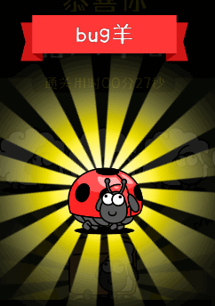

<div align="center"></div>

🐍 **[查看v1版本](./v1/README.md)** 🐍


# 🐏了个🐏 - v2

## 一、完成一次挑战

### 正常流程

1. GET /sheep/v1/game/map_info_ex?matchType=3

   拿到 map_md5 和 map_seed


2. POST /sheep/v1/game/game_over_ex?

   提交 MatchPlayInfo

用户完成游戏，小程序算出MatchPlayInfo的后，发起game_over请求


### 分析算法

代码已经提取到v2/index.js,  分析 MatchPlayInfo 是如何算出来的，不一定正确，仅供参考： 

```javascript
// 1. 进入游戏 -> 调用加载地图的两个函数 getTodayMap , getLevelMapData, -> 再调用了 beginGameData
e.prototype.beginGame = function() {
    var t = this;
    cc.game.emit(s.EMITKEY.TTSTARTRECORD), this.gameLayer.activeInHierarchy ? console.log("已经打开 mainLayer 1") : c.default.getTodayMap(h.default.getInstance().gameType, function() {
        for (var e = h.default.getInstance().mapMd5s, o = [], n = 0, i = function(i) {
            c.default.getLevelMapData(e[i], function(a) {
                n++, o[i] = a, n == e.length && (t.beginGameData(o), d.default.setGameLevelData(o));
            });
        }, a = 0; a < e.length; a++) i(a);
    });
}

// 2.1 加载地图
// getLevelMapData->
t.loadMapDataFromLocalStorageOrNetWork = function(e) {
    return new Promise(function(o, n) {
        var i = s.STORAGEKEY.GAMEMAP + e, a = t.getItem(i);
        if (a) o(a); else {
            var r = "https://cat-match-static.easygame2021.com/maps/" + e + ".txt";
            cc.assetManager.loadRemote(r, {
                ext: ".txt"
            }, function(e, a) {
                e ? n() : (t.setItem(i, a.text, 604800), o(a.text));
            });
        }
    });
}
// 2.2 加载地图
// getTodayMap->
t.getTodayMap = function(t, e) {
    p.default.get({
        url: "/sheep/v1/game/map_info_ex",
        params: {
            matchType: t
        },
        success: function(t) {
            0 == t.err_code ? (i.default.getInstance().mapMd5s = t.data.map_md5, i.default.getInstance().seed = t.data.map_seed, 
                               r.XorShift.instance.setSeed(t.data.map_seed), r.XorShift.instance.random(), e && e()) : cc.game.emit("showTips", "读取地图失败");
        }
    });
}

// 3. 处理游戏数据 --> 调用initLevelLayer
e.prototype.beginGameData = function(t) {
    var e = this;
    cc.game.emit(s.EMITKEY.SHOWTRANSITLAYER, function(o) {
        e.gameLayer.activeInHierarchy ? console.log("已经打开 mainLayer 2") : (console.log("可以打开了 mainLayer"), 
                                                                           e.gameLayer.getComponent(p.default).initLevelLayer(t), e.node.active = !1, o());
    });
},
     
// 4. 初始等级层? --> 初始化levelDataArray
e.prototype.initLevelLayer = function(t) {
	this.levelDataArray = JSON.parse(JSON.stringify(t));

// 5. 开始挑战 --> 使用 levelDataArray, 并调用initNextLevelMap
e.prototype.playNextLevelMap = function() {
	var e = JSON.parse(JSON.stringify(this.levelDataArray))[this.playLevelNum];
	this.gameIsWin = !1, this.gameIsStopFunc(!1), this.adaptScreen(), this.chessboard.getComponent(u.default).initNextLevelMap(e, this),

// 6. 下级地图 --> 调用initBlockNodeLayer
e.prototype.initNextLevelMap = function(t, e) {
    this.initBlockNodeLayer(!1), cc.game.emit(l.EMITKEY.SHOWMASKLAYER, 3), this.refreshIndex(), 

// 7. initBlockNodeLayer --> 设置cardId
e.prototype.initBlockNodeLayer = function(t) {
	var e = this.nowLevelData.levelData, o = 0;
    for (var n in e) for (var i in e[n]) e[n][i].cardId = o, o++, t ? this.addBlockFunc(e[n][i], cc.winSize.height) : this.addBlockFunc(e[n][i], 0);

// 8. addOp --> 使用cardId
addOp(t.cardDataObj.cardId)

// 9. addOp动作填充 operationList
t.prototype.addOp = function(t, e) {
                void 0 === e && (e = -100);
                var o = {
                    id: t,
                    time: Date.now()
                };
                this.operationList.push(o);
            }

//10. operationList算出p
for (var u = g.default.getInstance().operationList, p = [], d = 0, h = 0; h < u.length; h++) 
    p.push({
        chessIndex: u[h].id,
        timeTag: 0 == d ? 0 : u[h].time - d
    })
    d = u[h].time;

// 11. p算出f
var f = {
    gameType: g.default.getInstance().gameType,
    stepInfoList: p
},
                     
// 12. f初始化MatchPlayInfo(), 得到 v
v = k.protocol.MatchPlayInfo.encode(k.protocol.MatchPlayInfo.create(f)).finish()
令f_c = create(f) = new t(e) = function t(t) {if (this.stepInfoList = [], t) for (var e = Object.keys(t), o = 0; o < e.length; ++o) null != t[e[o]] && (this[e[o]] = t[e[o]]);}
encode(f_c) = for (var o = 0; o < t.stepInfoList.length; ++o) c.protocol.MatchStepInfo.encode(t.stepInfoList[o], e.uint32(34).fork()).ldelim();
        
// 13. 通过v算出b
b = "", _ = 0; _ < v.length; _++) b += String.fromCharCode(v[_]);

// 14. base64编码b,得到 MatchPlayInfo
MatchPlayInfo: S.default.base64_encode(b)
```


